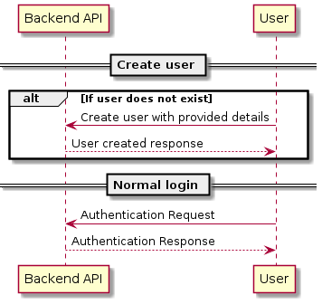

# CIC-Test
I chose the Virtuel White Board and focused on the backend.

# Virtual White Board

## Intro 

**Choice of language:**

As we talk about fast mockup i will go with python as backend and if I would do a frontend i would do a React based website in Javascript on the frontend connecting with the API on the backend. If i were to implement a scaleable and fast API i would look towards GO or rust. 

**Choice of API framework:**

I chose flask because it is famous for being fast to do mockup in for a REST api in. The api implemented is not very secure. and are lacking authentication parameters.

**Choice of databases:**
I went with two different kind of databases, an SQLite for user data and a simple json schema and reading and writing that to a file for white board data.

I deliberately implemented unit tests as i like developing that way and also in this instance it is nice verifying a long the way that the logic is correct.

## Backend architechture
### API 
The API needs to support both login and data extraction for contents on the WhiteBoard. The architecture will look something like this. Did not have time to expand too much on the white board data.

<p align="center">

</p>


### Login

Requirements for database storage of user information. 
 * Generic login without an email attached to it for company login.
 * Ability to reset password. Hence, an email need to be attached to this type login.
 * Personal logins with attached email.

<p align="center">

</p>

## Backend deployment

### By docker
Before being able to deploy either have docker and docker-compose installed. If only deploying by docker go to _./VirtualWhiteBoard/backend_ and run the following two commands.

```bash
user$ sudo docker build -t virtual_board_backend .
user$ sudo docker run --rm -it virtual_board_backend
```


For deploying the backend with docker-compose go to root directory where the _docker-compose.yml_ and call the command:

```bash
user$ docker-compose up
```

### By pip3 and python interpreter
Go to _VirtualWhiteBoard/backend_ and install packages

```bash
user$ pip install -r requirements.txt
```

and then run _backend.py_ inside _src_

```bash
user$ python3 src/backend.py
```

### Virtual board content
Implemented backend for: 
 * Motivational text
 * Image links
