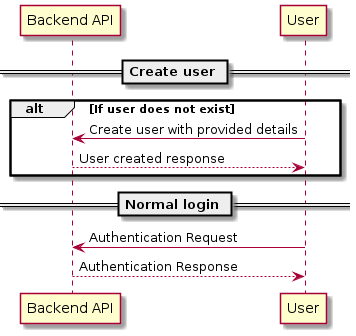

# Virtual White Board

## Intro 
I will focus on the backend part and if time allows create some frontend as well. 
As we talk about fast mockup i will go with python as backend and a React based website in Javascript on the frontend.

## Backend architechture
### API 
The API needs to support both login and data extraction for contents on the WhiteBoard.

### Login
A database setup should be provided for login credentials. Requirements
 * Generic login without an email attached to it.
 * Ability to reset password. Hence, an email need to be attached to this login.
 * Personal logins with attached email.

## Backend deployment
Start the docker-compose file.

### Vitual board content

## Frontend 

